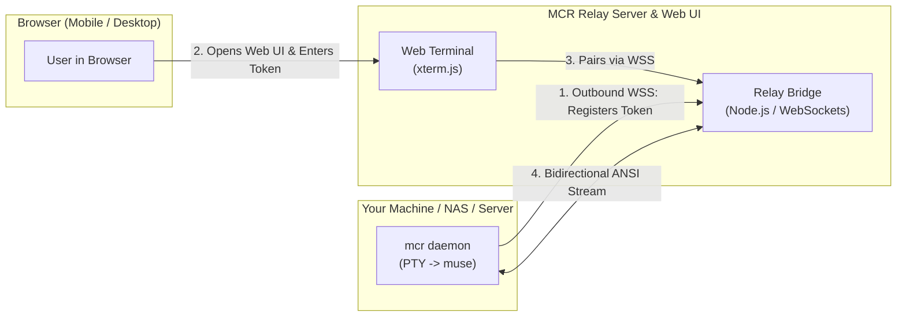

# ⚡ Muse Code Remote (MCR)

> Open-source Web UI & Outbound Terminal Relay for [Meta Muse Code](https://research.meta.ai/blog/introducing-muse-code-and-muse-spark-1-2).

Access your terminal-based **Muse Code** coding agent securely from any web browser (desktop, tablet, or smartphone) without exposing your machine, forwarding ports, or sharing credentials.

---

## 🎯 Architecture



### Key Highlights
* **Zero Open Ports / NAT Traversal:** The client daemon connects **outbound** via standard HTTPS/WSS (Port 443). Works behind firewalls, CGNAT, and home routers.
* **Pure Bring-Your-Own-Account:** Muse Code executes **locally on your machine** with your own Meta account, API subscription, and permissions (including root/host access if desired).
* **Zero Server Overhead:** The relay server stores no private code or credentials—it purely mirrors the interactive VT100/ANSI TUI terminal over WebSockets.
* **Auto-Resize & Truecolor:** Dynamic terminal window adjustments and full 256-color / truecolor support via `xterm.js`.

---

## 🚀 Quick Start (Client)

### 1. Installation

Run the one-line installer on any Linux or macOS machine:

```bash
curl -fsSL https://raw.githubusercontent.com/SecretLUL/MuseCodeRemote/main/client/install.sh | bash
```

### 2. Start the Daemon

```bash
mcr
```

Output:
```text
════════════════════════════════════════════════════════════════════
  ⚡ Muse Code Remote (MCR) Daemon
════════════════════════════════════════════════════════════════════
  Session Token:   mcr-a7f9-2c4e
  Direct Web Link: https://muse.yourdomain.com/?token=mcr-a7f9-2c4e
  Command:         /usr/local/bin/muse
  Working Dir:     /home/user/myproject
════════════════════════════════════════════════════════════════════
  Waiting for browser connection... (Press Ctrl+C to stop)
```

Click the direct link or open the Web UI, and your Muse Code TUI appears live in your browser!

### Instant Run (Zero-Install)
If you don't want to install the binary to your disk, run it on-demand:
```bash
curl -fsSL https://raw.githubusercontent.com/SecretLUL/MuseCodeRemote/main/client/run.sh | bash
```

---

## 🛠️ Self-Hosting the Relay & Web UI

### Using Docker Compose

1. Clone this repository:
```bash
git clone https://github.com/SecretLUL/MuseCodeRemote.git
cd MuseCodeRemote
```

2. Start the service:
```bash
docker compose up -d
```

The Web UI and Relay listen on port `8765`.

### Reverse Proxy Configuration (Nginx / NPM)

If using **Nginx Proxy Manager**:
1. Add a new **Proxy Host** for your domain (e.g., `muse.yourdomain.com`).
2. Forward to `muse-code-remote` (or your host IP) on port `8765`.
3. **Crucial:** Enable **Websockets Support** toggle in the host settings.
4. Enable SSL with Let's Encrypt.

If using standard **Nginx**, ensure `Upgrade` and `Connection` headers are passed:
```nginx
location / {
    proxy_pass http://localhost:8765;
    proxy_http_version 1.1;
    proxy_set_header Upgrade $http_upgrade;
    proxy_set_header Connection "upgrade";
    proxy_set_header Host $host;
}
```

---

## 📄 License
[MIT](LICENSE)
